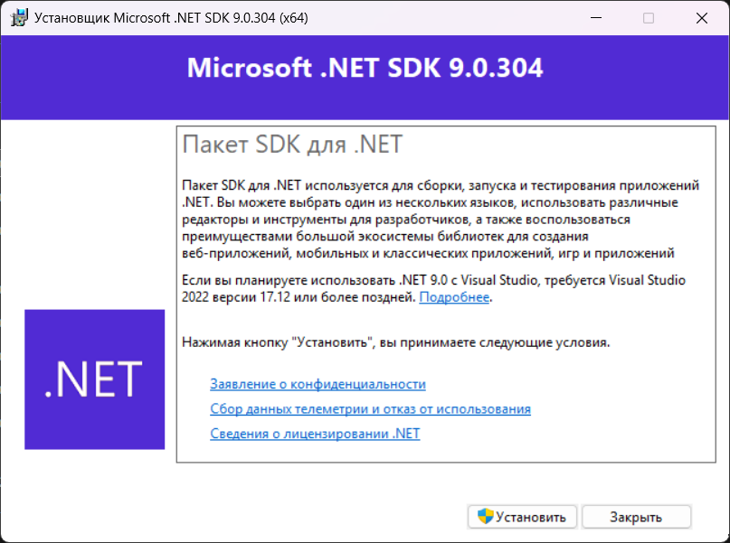
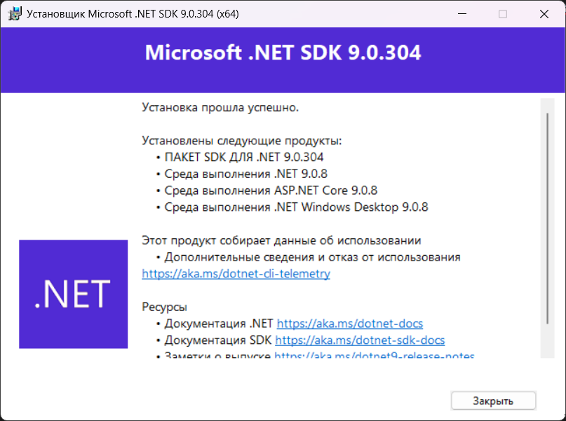
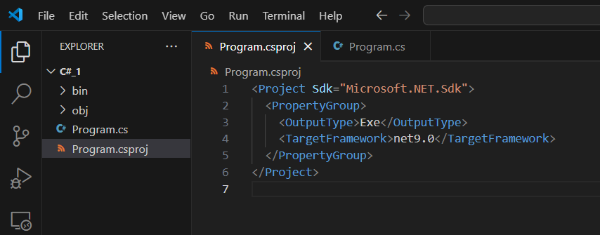
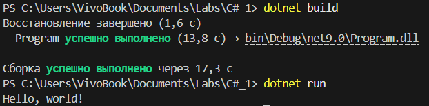
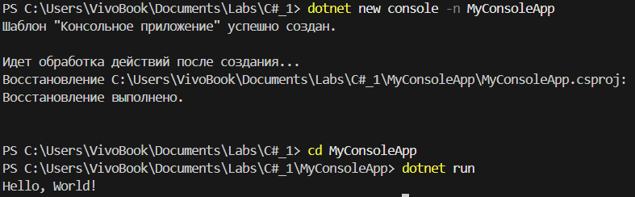

Установил .NET с официального сайта

 

 

Убедился, что `dotnet` доступен для выполнения в командной строке.

Создал новый C# проект, создав файл конфигурации `Program.csproj` и файл с кодом `Program.cs`

 

Создать еще один новый проект, используя команду `dotnet new console -n MyConsoleApp`и скомпилировал и выполнил программу, используя команду `dotnet run.

