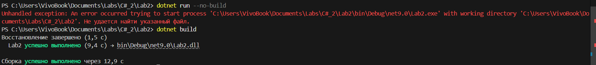

## Цели

- Изучить артефакты компиляции (`bin`, `obj`).
    
- Освоить запуск и сборку проекта.
    
- Разобраться с базовыми инструкциями и функциями.
    

---

## Ход работы

### 1. Компиляция и запуск

1. Удалены папки `bin` и `obj`.  
2. Попытка запуска `dotnet run --no-build` → ошибка.  
3. Сборка проекта через `dotnet build`.  
    
    
4. Запуск `.exe` файла через консоль.  

---

### 2. Базовые инструкции

#### 2.1. Вывод текста

Код:

`Console.WriteLine("Hello, Jerry");`

#### 2.2. Функция с `A B C`

#### 2.3. Вызовы функций

#### 2.4. Неиспользуемая функция

#### 2.5. Порядок функций

---

## Вывод

В ходе лабораторной работы были изучены:

- Процесс компиляции и запуск exe-файла.
    
- Работа с исходным кодом и базовыми инструкциями.
    
- Использование функций и их вызовов.
    
- Поведение неиспользуемых функций.
    
- Порядок определения функций в C#.