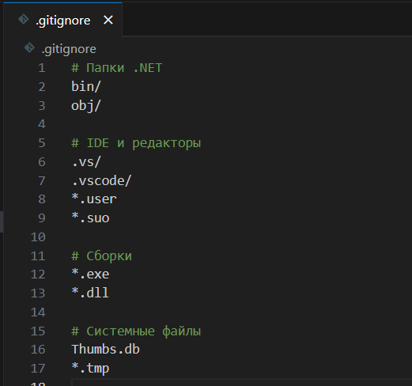

## Тема

Настройка Git для общего репозитория лабораторных работ.

---

## Цели

* Настроить Git-репозиторий для всего курса.
* Создать `.gitignore` для временных файлов.
* Сделать первый коммит.
* Разместить работы на GitHub.

---

## Ход работы

### 1. Создание `.gitignore`

### 2. Инициализация репозитория и коммит

* Инициализация репозитория и добавлены всех файлов и выполнене коммита:

### 3. Репозиторий на GitHub

### 4. Отправка изменений

* Связаны локальный и удалённый репозитории:

---

## Вывод

В результате лабораторной работы:

* Создан локальный репозиторий Git для всех лабораторных работ по предмету.
* Настроен `.gitignore` для исключения временных файлов.
* Выполнен первый коммит и проект опубликован на GitHub.