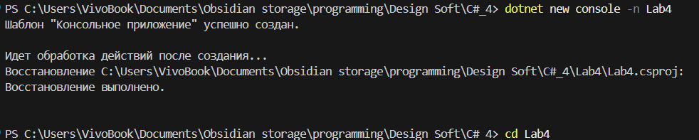
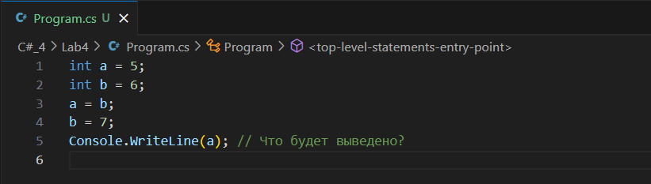
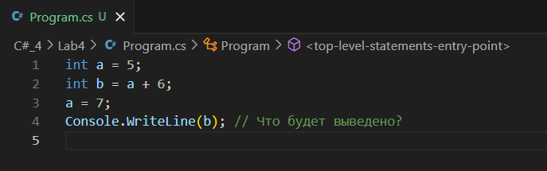
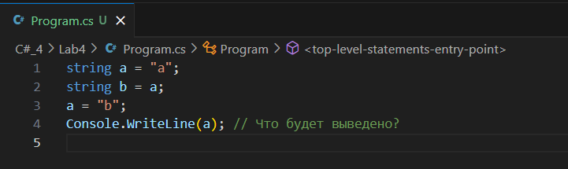
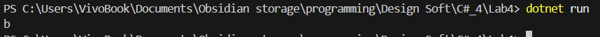
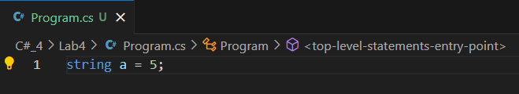
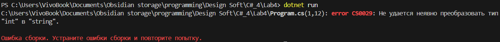

### Тема: Базовое взаимодействие с памятью через переменные.

### Цели:

- Понимать, как переменные хранят данные в памяти (стек/хип).
- Различать типы-значения и ссылочные типы.
- Анализировать поведение переменных при присваивании и изменении.

0. Создаем проект

1. Пример с целыми числами

Анализ:
- В a записалось значение 6.
- Последующее изменение b = 7 не влияет на a.

2. Пример с выражением

Анализ:
- b получает результат выражения a + 6 → 11.
- Изменение a не влияет на b.

3. Пример со строками

Анализ:
- b хранит ссылку на объект "a".
- Переназначение a = "b" меняет только ссылку a.

4. Пример с ошибкой типов

Анализ:
- Ошибка компиляции: тип int нельзя присвоить переменной типа string.

### Вывод

В ходе лабораторной работы:
- Изучено, как значения копируются между переменными.
- Понято различие между типами-значениями и ссылочными типами.
- Проанализированы ошибки типов и поведение памяти при изменении переменных.