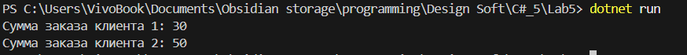

## Цель работы

Закрепить знания по элементарным техникам программирования:

* работа с выражениями;
* использование блоков для ограничения видимости переменных;
* группировка данных в структуры или классы;
* использование функций для устранения повторяющегося кода;
* понимание механизма вызова функций.

---

## Задание

1. Представить ситуацию: есть 3 товара (напиток, первое, второе) с ценами `10`, `20`, `30`.
2. Два клиента заказывают разные комбинации товаров. Вывести стоимость их заказов.
3. Использовать **блоки** для работы с каждым клиентом, применять одинаковые имена переменных внутри блоков.
4. Создать **структуру цен** и использовать её вместо прямых значений.
5. Написать функцию, принимающую на вход цены и выбор клиента.
6. Вынести повторяющийся код в отдельную функцию для получения цены товара.

---

### Код программы (`Program.cs`)

```csharp
using System;

// 3. Структура для хранения цен
public struct Prices
{
    public int Drink;
    public int First;
    public int Second;

    public Prices(int drink, int first, int second)
    {
        Drink = drink;
        First = first;
        Second = second;
    }
}

class Program
{
    static void Main()
    {
        // Создаем общий объект с ценами
        Prices prices = new Prices(10, 20, 30);

        // 2. Блок для клиента 1
        {
            int choice1 = 0; // напиток
            int choice2 = 1; // первое
            int total = CalculateOrder(prices, choice1, choice2);
            Console.WriteLine("Сумма заказа клиента 1: " + total);
        }

        // 2. Блок для клиента 2
        {
            int choice1 = 1; // первое
            int choice2 = 2; // второе
            int total = CalculateOrder(prices, choice1, choice2);
            Console.WriteLine("Сумма заказа клиента 2: " + total);
        }
    }

    // 4. Функция для расчета заказа клиента
    static int CalculateOrder(Prices prices, int choice1, int choice2)
    {
        // 5. Используем отдельную функцию для извлечения цены
        return GetPrice(prices, choice1) + GetPrice(prices, choice2);
    }

    // 5. Функция для получения цены по коду товара
    static int GetPrice(Prices prices, int choice)
    {
        return choice switch
        {
            0 => prices.Drink,
            1 => prices.First,
            2 => prices.Second,
            _ => 0
        };
    }
}
```

---

## Результат выполнения

При запуске программы вывод:



---

## Вывод

В ходе лабораторной работы я:

* реализовал программу с двумя клиентами и заказами;
* использовал блоки для разделения логики;
* создал структуру `Prices` для группировки цен;
* написал функции `CalculateOrder()` и `GetPrice()` для устранения повторяющегося кода;
* проверил работу программы на практике.