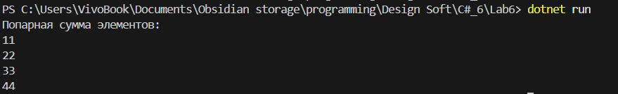

# Лабораторная работа №6

**Тема:** Алгоритмы

## Цель работы

* Понять структуру алгоритма (ввод, обработка, вывод).
* Освоить декомпозицию задач на подзадачи.
* Научиться работать со списками и массивами, индексами и суммами элементов.
* Продемонстрировать пример алгоритма, вызывающего другой алгоритм.

---

## Задание

1. Понять, как подойти к решению сложной задачи (декомпозиция).
2. Вывести алгоритм решения задачи:
   *"Дано 2 списка с равным количеством чисел. Вычислите попарную сумму элементов из этих списков (первый элемент из первого списка, первый из второго; второй элемент из первого списка, второй из второго; …)"*
3. Реализовать алгоритм на C# с использованием массивов/списков и функции для подсчёта попарной суммы.

---

## Алгоритм решения задачи (псевдокод)

1. Получить два списка чисел одинаковой длины: `list1` и `list2`.
2. Создать пустой список `sumList`.
3. Для каждого индекса `i` от 0 до длины списка:

   * вычислить `list1[i] + list2[i]`
   * добавить результат в `sumList`.
4. Вывести `sumList`.

---

## Код на C# (`Program.cs`)

```csharp
using System;
using System.Collections.Generic;

class Program
{
    static void Main()
    {
        // Два исходных списка
        List<int> list1 = new List<int> { 1, 2, 3, 4 };
        List<int> list2 = new List<int> { 10, 20, 30, 40 };

        // Вызов функции для вычисления попарной суммы
        List<int> sumList = PairwiseSum(list1, list2);

        // Вывод результата
        Console.WriteLine("Попарная сумма элементов:");
        foreach (var sum in sumList)
        {
            Console.WriteLine(sum);
        }
    }

    // Функция, вычисляющая попарную сумму
    static List<int> PairwiseSum(List<int> list1, List<int> list2)
    {
        List<int> result = new List<int>();

        for (int i = 0; i < list1.Count; i++)
        {
            // Вызов "подалгоритма" для суммы двух чисел
            result.Add(SumTwoNumbers(list1[i], list2[i]));
        }

        return result;
    }

    // Подалгоритм: сумма двух чисел
    static int SumTwoNumbers(int a, int b)
    {
        return a + b;
    }
}
```

---

## Объяснение работы программы

1. **Декомпозиция задачи:**

   * Основной алгоритм `PairwiseSum` обходит списки и вызывает подалгоритм `SumTwoNumbers`.
   * Подалгоритм `SumTwoNumbers` делает элементарное действие — сложение двух чисел.

2. **Работа со списками:**

   * Используется индекс `i`, который перебирает все элементы списка.
   * Для хранения результатов используется отдельный список `result`.

3. **Вызов подалгоритма:**

   * `PairwiseSum` использует `SumTwoNumbers` для каждого элемента.

## Результат выполнения

При запуске программы вывод:



## Вывод

* Сложная задача была разбита на подзадачи: обработка списков и сложение элементов.
* Освоена работа с **массивами и списками**, использование **индексов**.
* Создан алгоритм, который вызывает другой алгоритм (декомпозиция и повторное использование кода).
* Понимание алгоритмической структуры: ввод → обработка → вывод.